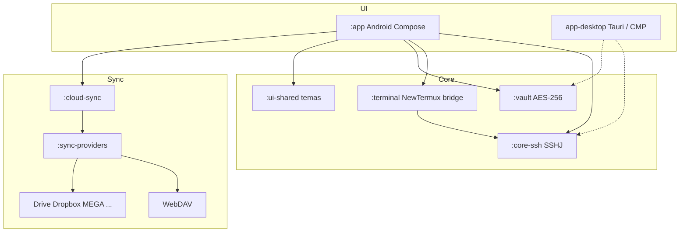

# CloudTerm Pro

Cliente **SSH / SFTP / túneles** multiplataforma, open source y sin servidores propios.
Evolución de CyberTerm → arquitectura modular lista para Android, escritorio y sync en la nube.

[](https://github.com/pilahito/AdministradorArchivos/actions/workflows/compilar-apk.yml)
[](https://github.com/pilahito/AdministradorArchivos/actions/workflows/android.yml)
[](LICENSE)
[](https://github.com/pilahito/AdministradorArchivos/releases)

**Descarga:** [Releases](https://github.com/pilahito/AdministradorArchivos/releases) → APK Android (`CloudTermPro-debug.apk` / `CyberTerm-debug.apk`).

---

## Características

- Sesiones SSH con contraseña o clave privada
- Terminal interactiva + SFTP
- Túneles locales `-L`
- Bóveda cifrada AES-256 (PBKDF2) — módulo `:vault`
- Sync opcional vía **tus** proveedores (WebDAV listo; Drive/Dropbox/MEGA/… stubs)
- Temas: Dark Cyan Neon, Dracula, Solarized Light, Cyberpunk
- Open source — sin paywall ni telemetría a servidores de CloudTerm

## Privacidad

CloudTerm Pro **no opera servidores propios**. Las credenciales y la bóveda viven en tu dispositivo.
La sincronización (si la activas) habla solo con el proveedor que tú elijas (Nextcloud/WebDAV, Drive, etc.).

## Arquitectura



## Módulos Gradle

| Módulo | Rol |
|--------|-----|
| `:app` | UI Android (Compose) — applicationId sin cambios |
| `:core-ssh` | API Kotlin: connect / startShell / exec / openSftp / createTunnel |
| `:vault` | vault.db cifrado + logs de acceso + stubs biométricos |
| `:sync-providers` | `SyncProvider` + WebDAV + stubs nube |
| `:cloud-sync` | Orquestador (retry, `/Apps/CloudTermPro/`) |
| `:terminal` | `TerminalSession` / `SshTerminalBridge` → NewTermux |
| `:ui-shared` | Tokens de color multiplataforma |

## Build

### Android (APK)

```bash
./gradlew :app:assembleDebug
# salida: app/build/outputs/apk/debug/app-debug.apk
```

### Librerías JVM (sin SDK Android)

```bash
./gradlew :core-ssh:compileKotlin :vault:compileKotlin :sync-providers:compileKotlin
./gradlew :cloud-sync:compileKotlin :terminal:compileKotlin :ui-shared:compileKotlin
```

### Roadmap binarios

| Artefacto | Estado |
|-----------|--------|
| APK Android | CI actual (`compilar-apk.yml` / `android.yml`) |
| EXE escritorio | Stub Tauri / Compose Multiplatform en `app-desktop/` |
| DEB Linux | Workflow stub `deb.yml` |

Ver [docs/BUILD.md](docs/BUILD.md).

## Proveedores de sync

| Proveedor | Estado |
|-----------|--------|
| WebDAV (Nextcloud, ownCloud, …) | Implementación básica |
| MEGA | Stub |
| Google Drive | Stub (+ OAuth parcial en `:app`) |
| Dropbox / OneDrive / TeraBox / 1fichier | Stubs |

Ruta remota por defecto: `/Apps/CloudTermPro/`.

## Capturas

> Sección reservada — añade PNG en `docs/screenshots/` (Sesiones, Terminal, SFTP, Ajustes).

| Sesiones | Terminal | SFTP |
|----------|----------|------|
| _próximamente_ | _próximamente_ | _próximamente_ |

## Documentación

- [Arquitectura](docs/ARQUITECTURA.md)
- [Build](docs/BUILD.md)
- [Contribuir](CONTRIBUTING.md)
- [Seguridad](SECURITY.md)
- [Fuentes / licencias](docs/FUENTES.md)
- [Changelog](CHANGELOG.md)

## Licencia

Ver [LICENSE](LICENSE). Termux / Material Files **no se copian** (GPL); ver `docs/FUENTES.md`.