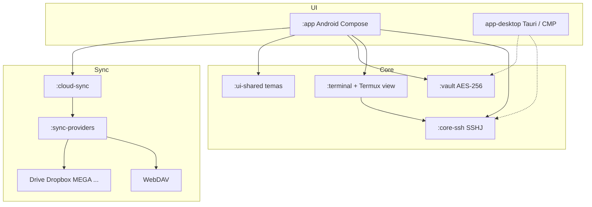
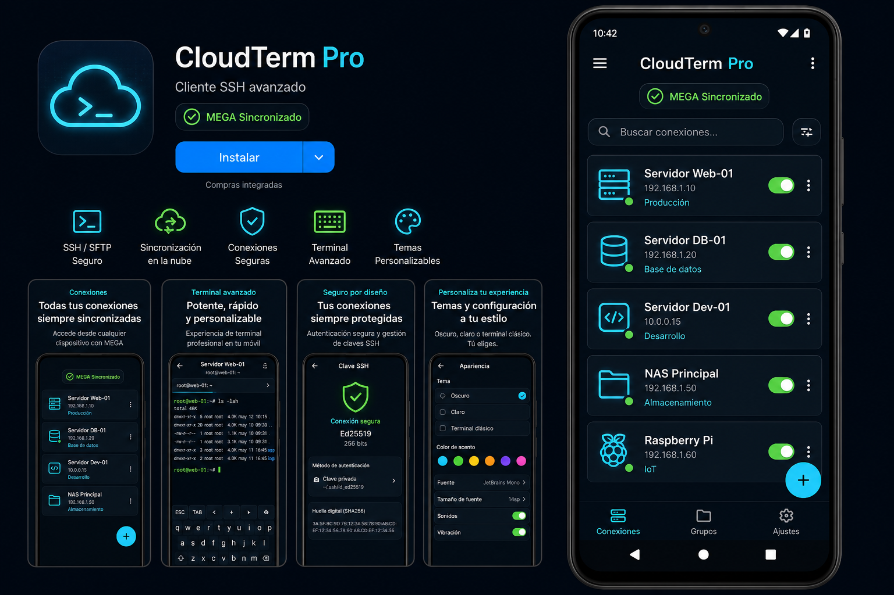
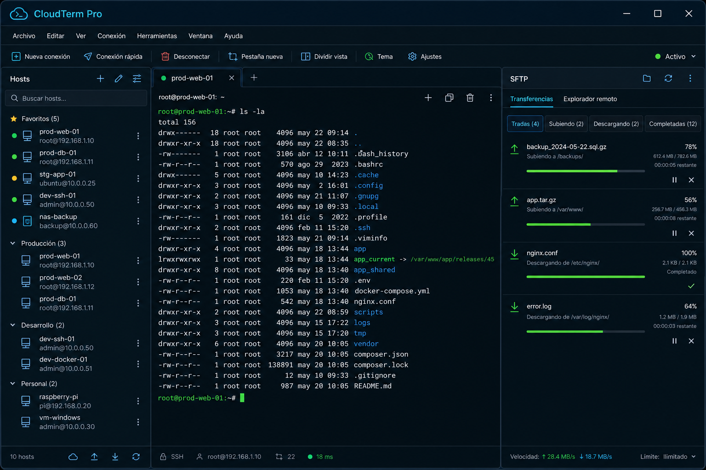
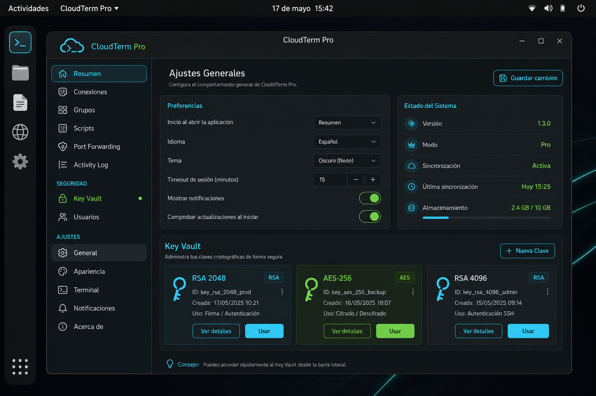

# CloudTerm Pro

[](https://github.com/pilahito/AdministradorArchivos/releases)

**Alternativa open source a Termius**: cliente SSH / SFTP / túneles / bóveda de claves,
sin paywall ni servidores propios. UI Android oscura neón (Hosts · Terminal · SFTP · Bóveda · Ajustes).

[](https://github.com/pilahito/AdministradorArchivos/actions/workflows/compilar-apk.yml)
[](https://github.com/pilahito/AdministradorArchivos/actions/workflows/android.yml)
[](LICENSE)

**Descarga:** [Releases](https://github.com/pilahito/AdministradorArchivos/releases) → APK Android.

> ¿Buscas algo *parecido a Termius* pero con código fuente? Este repo es exactamente eso:
> sesiones SSH, emulador de terminal real (Termux VT), SFTP, vault cifrado y sync a *tu* nube.

---

## Características

- Sesiones SSH con contraseña o clave privada (SSHJ + JSch)
- **Terminal real**: `AndroidView` + Termux `terminal-emulator` / `terminal-view` (JitPack), I/O por shell SSHJ
- SFTP con cola de transferencias (UI)
- Túneles locales `-L`
- Bóveda cifrada AES-256 (PBKDF2) — módulo `:vault`
- Sync opcional vía **tus** proveedores (WebDAV listo; Drive/Dropbox/MEGA/… stubs)
- Temas: Dark Cyan Neon, Dracula, Solarized Light, Cyberpunk
- Open source (GPL-3) — sin telemetría a servidores de CloudTerm

## Privacidad

CloudTerm Pro **no opera servidores propios**. Las credenciales y la bóveda viven en tu dispositivo.
La sincronización (si la activas) habla solo con el proveedor que tú elijas (Nextcloud/WebDAV, Drive, etc.).

## Arquitectura



## Módulos Gradle

| Módulo | Rol |
|--------|-----|
| `:app` | UI Android (Compose) + emulador Termux en Terminal |
| `:core-ssh` | API Kotlin: connect / startShell / exec / openSftp / createTunnel |
| `:vault` | vault.db cifrado + logs de acceso + stubs biométricos |
| `:sync-providers` | `SyncProvider` + WebDAV + stubs nube |
| `:cloud-sync` | Orquestador (retry, `/Apps/CloudTermPro/`) |
| `:terminal` | Contrato `TerminalSession` / `SshTerminalBridge` |
| `:ui-shared` | Tokens de color multiplataforma |

## Build

### Android (APK)

```bash
./gradlew :app:assembleDebug
# salida: app/build/outputs/apk/debug/app-debug.apk
```

### Librerías JVM (sin SDK Android)

```bash
./gradlew :core-ssh:compileKotlin :vault:compileKotlin :sync-providers:compileKotlin
./gradlew :cloud-sync:compileKotlin :terminal:compileKotlin :ui-shared:compileKotlin
```

Ver [docs/BUILD.md](docs/BUILD.md).

## Proveedores de sync

| Proveedor | Estado |
|-----------|--------|
| WebDAV (Nextcloud, ownCloud, …) | Implementación básica |
| MEGA | Stub |
| Google Drive | Stub (+ OAuth parcial en `:app`) |
| Dropbox / OneDrive / TeraBox / 1fichier | Stubs |

Ruta remota por defecto: `/Apps/CloudTermPro/`.

## Capturas y mockups

| Android | Windows | Linux |
|:---:|:---:|:---:|
|  |  |  |

Mockup objetivo (Termius-like): [docs/mockups/target-ui.png](docs/mockups/target-ui.png)

## Documentación

- [Registro de mejoras](docs/MEJORAS.md) · [Changelog](CHANGELOG.md)
- [Arquitectura](docs/ARQUITECTURA.md) · [Build](docs/BUILD.md)
- [Fuentes / licencias](docs/FUENTES.md) · [NOTICE](NOTICE)
- [Contribuir](CONTRIBUTING.md) · [Seguridad](SECURITY.md)

## Licencia

[GPL-3.0-or-later](LICENSE) (necesario para enlazar Termux `terminal-view`).
SSHJ / JSch siguen siendo Apache-2.0. **No copies** código ni assets de Termius.
